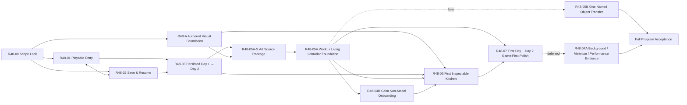

# STEAM_DESKTOP — First 48 Hours Playable Roadmap v1

Дата создания: 2026-07-12

Обновлено: 2026-07-13

Статус: active execution roadmap / R48-01 + R48-02 + R48-03 completed PASS / R48-05A mechanical evidence retained / Art reconciliation sequence active

Владелец: Producer / Project Manager

Партнёры: Game Designer / Art Director / Codex

Продукт: Shelter Steam/Desktop

Назначение: превратить доказанные First Day и Day 2 runtime-сценарии в один честный session-based пользовательский путь, который запускается обычным способом, выглядит как живая authored игра, сохраняется и позволяет вернуться к Day 2 без dev-команд и fixture-флагов.

---

## 0. Почему этот roadmap появился

После закрытия R-29 выяснился важный разрыв между двумя правдивыми утверждениями:

1. First Day и Day 2 доказаны как prototype/product-language/runtime-evidence.
2. Пользователь, запускающий Godot обычным Project Run, всё ещё не получает игру, в которую можно естественно войти, закрыть, вернуться и продолжить.

R-29 не был фиктивной работой: он доказал причинность задач, ресурсов, заказов и физической цепочки, а также защитил её регрессиями. Но слово `GREEN` относилось к сценарию и evidence harness, а не к готовому First Day + Day 2 player journey.

Причина смены приоритета:

> Следующий полезный результат должен быть не ещё одним изолированным tech/art proof, а единым запускаемым опытом First Day + Day 2; `First 48 Hours` остаётся внутренним именем программы, не календарным обещанием.

Поэтому ранее обсуждавшийся isolated World Layer Composition Tech Spike больше не является рекомендуемым следующим главным шагом. Он может вернуться только как зависимость конкретного playable brief. Самостоятельно он снова увеличил бы лабораторию доказательств, не приблизив обычный запуск игры.

Этот roadmap:

- не принимает новую механику сам по себе;
- не превращает First Week в семь реализованных календарных дней;
- не обещает First Month;
- не утверждает production art или shipping desktop readiness;
- фиксирует последовательность решений, briefs, реализации и приёмки, нужную для внутренней First Day + Day 2 / two-session playable-сборки.

### 0.1 Game-first execution update — 2026-07-12

После завершения R48-03 пользователь явно исправил ближайший приоритет: техническая continuity уже доказана, а blocker пользовательской ценности — прямоугольный prototype presentation без authored мира, living Labrador, нормальной Kitchen и достаточной анимации.

Текущий критический путь после user-owner scope clarification 2026-07-13:

```text
1. PM/User accepts the prepared Art reconciliation brief/package and pins the current visual roster.
2. Art owns one bounded source-only wave restoring D-011 + approved_art_files + accepted Labrador fidelity over existing mechanics.
3. A separate accepted/executable Codex integration brief imports only the accepted source result.
4. Immutable runtime evidence receives independent Art review and explicit user-owner review.
5. R48-05B, rooms, onboarding, background/minimize/performance and broad dog-life work remain later/backlog until separately prioritized.
```

Это изменение порядка не отменяет D-023, accepted runtime causality или будущие Program gates. Оно запрещает новый v6 patch loop и не активирует R48-05B, rooms, onboarding или R48-04A. Approved Mill может быть включён только как static decorative object без mechanic/task/resource/output/input. Labrador остаётся первой living dog; calm back-and-forth read имеет статус `NEEDS_MANIFEST_AMENDMENT`: existing start/walk/stop/turn rows reuse, bounded selector amendment and Game Design + Producer/PM + Technical/Codex re-sign before any executable brief. Dachshund/cart сейчас не является requirement.

Предыдущий R48-05A brief завершил bounded mechanical evidence, но overall current look отклонён и не создаёт authority для v6 или reconciliation mutation. Текущий Art reconciliation package остаётся `PREPARED_FOR_PM_ACCEPTANCE / NOT EXECUTABLE`; следующий runtime write возможен только по новой staged sequence выше.

---

## 1. Целевой пользовательский опыт

Целевая последовательность программы:

```text
обычный F5 / Project Run / internal export
→ чистый player mode без debug harness
→ First Day начинается как естественный первый вход
→ игрок несколькими осмысленными подтверждениями влияет на мир
→ собаки спокойно выполняют физически видимую работу
→ игру можно оставить открытой в фоне и изредка поглядывать
→ прогресс автоматически сохраняется в безопасных точках
→ игрок закрывает игру
→ следующий обычный запуск продолжает тот же мир
→ видны последствия First Day
→ Day 2 начинается без CLI и fixture-флага
→ игрок может открыть одну живую комнату
→ вторая поставка завершается
→ мир входит в restart-stable Quiet Cooperative
```

Требуемое ощущение:

- влияние без микроменеджмента;
- участие без обязанности;
- спокойная жизнь мира без наказания за отсутствие;
- физически наблюдаемая причинность вместо абстрактных таймеров;
- личные следы помощи вместо generic daily reward;
- возможность работать за компьютером, пока Shelter живёт рядом.

---

## 2. Честная исходная точка

### 2.1 Что уже действительно доказано

В репозитории есть и проверены:

- детерминированная task/resource/order causality;
- полный узкий First Day loop:
  `route → trip → unload → carry → cook → pack → load → delivery → postcard/slippers/memory`;
- полный Day 2 same-chain loop с отдельными `first_day_history`, `active_order`, `active_chain` и `day2`;
- 52/52 Day 2 assertions и First Day regression;
- fixture, Godot connector/control API и Workbench capture harness;
- dev save/import/export foundation;
- window/companion и dog-rig technical spikes;
- First Day / Day 2 product, game-design, art and runtime contracts;
- Sheet A/B preview R&D с Art WARN и без root contract failure.

Это серьёзный фундамент: следующая работа не должна переписывать доказанную причинность.

### 2.2 Что обычный запуск делает сейчас

Текущий `steam/project.godot` запускает `res://scenes/main.tscn`.

Текущий bootstrap shell показывает только тёмный фон и надпись `Shelter`. Он не входит в First Day, Day 2, Vertical Slice или companion experience.

Dev-команды обходят этот entry point и отдельно запускают Vertical Slice. Поэтому успешный runtime proof не равен доступному игроку пути.

### 2.3 First Day сейчас

First Day существует как рабочий Vertical Slice и может быть запущен через dev surface. В нём:

- несколько решений остаются у игрока;
- собаки автоматически исполняют физические microtasks;
- причинная цепочка завершается корректно;
- после `chain_complete` нет естественного перехода в следующий пользовательский сеанс;
- обычный F5 его не открывает.

### 2.4 Day 2 сейчас

Day 2 существует как детерминированный continuation fixture:

```text
second_day_after_first_delivery
```

Он доказан runtime-событиями и captures, но:

- не достигается органически из First Day;
- требует dev launch / fixture selection;
- не загружается обычным пользовательским продолжением;
- не является доказательством player save lifecycle.

### 2.5 First Week и First Month сейчас

`First Week Direction v1` определяет First Week как:

```text
Day 2 + first repeatable direction + first longer-retention promise
```

Это product direction, а не реализованные семь дней.

Day 3, Day 4–5 и конец недели остаются candidates. Отдельного принятого и реализованного First Month journey нет.

Следовательно, текущий roadmap не должен обещать «пару дней игры» через выдуманный First Week/Month контент. Сначала он делает реально проходимыми уже доказанные First Day и Day 2.

### 2.6 Save и return сейчас

Имеется dev-oriented сохранение под `.runtime`, но нет полного player save contract:

- нет обычного autosave/autoload lifecycle;
- нет production-path хранения в `user://`;
- safe-checkpoint/no-exact-in-flight policy принята, но exact `PlayerCheckpointV1` и checkpoint set ещё не определены R48-02B;
- нет player-facing Continue/New Game;
- нет recovery для повреждённого save;
- нет автоматического First Day → Day 2 continuation;
- dev save и player save ещё не разведены как продуктовые поверхности.

### 2.7 Background/idle сейчас

Открытый runtime может продолжать симуляцию, пока получает кадры, но ещё не доказаны:

- спокойный player-facing 1x cadence;
- unfocused/minimized поведение на целевых ОС;
- отсутствие неожиданных скачков после долгой паузы;
- 30–60 минут CPU/GPU/memory/power evidence;
- meaningful ambient life после завершения текущей цепочки;
- evidence, что accepted frozen closed-app policy действительно даёт ноль progress/reward/penalty.

После завершения цепочки собаки в основном приходят к статичному idle. Это ещё не «живой фон на пару рабочих дней».

### 2.8 Визуалы сейчас

Playable Vertical Slice использует лишь небольшое число временных semantic PNG и много code-drawn форм:

- ground и path — примитивные полосы/формы;
- собаки — процедурные силуэты/формы;
- Packing Table, ресурсы и часть наград — placeholders;
- world/room Sheet A/B находятся вне runtime и имеют статус PREVIEW_RESEARCH_ONLY;
- эти sheets нельзя незаметно импортировать как production assets.

### 2.9 Анимации собак сейчас

Числа из vocabulary нельзя читать как число готовых анимаций:

- 67 semantic action/activity/layer IDs — это карта языка и покрытия;
- 89 total IDs включают support IDs;
- число около 193 — planning estimate authoring units для гипотетического roster, а не «193 состояния одной собаки»;
- P0 production bindings: `0/29`;
- debug analogs: `7/29`;
- отсутствуют аналоги: `22/29`;
- семь клипов существуют только как runtime-created AnimationPlayer proof в изолированном dog-rig spike;
- Vertical Slice эти клипы не использует;
- authored `.anim/.tres/.res` dog library отсутствует;
- facing/mirror/physical-turn production contract ещё не доказан.

### 2.10 Комнаты сейчас

Runtime содержит metadata/scaffold room records, но не player-facing комнаты:

- нет room scene/interior renderer;
- нет click/open/close flow;
- нет dog entry/exit и occupancy handshake;
- нет единого runtime-представления одной собаки между strip и room;
- same-window room surface принята; exact modal/side-panel composition ещё не выбрана Art/UX + Technical;
- Sheet B доказал preview room grammar, а не modular reconstruction или runtime room.

---

## 3. Программа R48 и порядок зависимостей



Это program dependency view, а не текущая activation queue. Текущая очередь определяется §0.1 и §17; R48-04B, R48-06, R48-07, R48-05B и R48-04A сейчас не активированы.

Правило последовательности:

> Нельзя закрывать проблему нормального запуска новым standalone proof. Любая техническая или художественная волна должна быть привязана к конкретному player-facing DoD этой программы.

Уточнение после cross-role preflight:

- R48-01 и R48-02 можно проектировать параллельно, но их acceptance закрывается совместно: working `Continue` зависит от player save;
- запись в общий checkout выполняет один последовательный integrator;
- текущая active sequence: `Art reconciliation PM/User acceptance → bounded Art source wave → ambient-walk manifest amendment/re-sign → separate Codex integration brief → runtime Art/user review`;
- остальные program gates (`R48-04B`, `R48-06`, `R48-07`, `R48-05B`, `R48-04A`) остаются later/open и требуют отдельной будущей приоритизации;
- Art source work может идти параллельно в отдельном file scope, но runtime Art PASS появляется только после import/readback в обычном player journey.

---

## 4. R48-00 — First 48 Hours Scope Lock

Статус: accepted / D-023

Владельцы: Producer + Game Designer + Art Director + PM

Codex: sequential implementation under accepted bounded briefs

### Цель

Зафиксировать ровно тот player journey, который затем реализует Codex, не заставляя его самостоятельно выбирать продуктовые, геймдизайнерские или художественные правила.

### Accepted R48-00 contract

1. **Что значит «завтра».**
   - Narrative session day: первый обычный `Continue` после полностью завершённого First Day.
   - Restart до полной границы First Day продолжает First Day.
   - Restart внутри Day 2 продолжает тот же Day 2.
   - Wall clock не продвигает день; player-facing copy предпочтительно использует «в следующий раз».

2. **Что происходит, пока приложение закрыто.**
   - Мир frozen: `simulation = 0`.
   - Нет offline catch-up, rewards, resource production, decay, loss, neglect или penalties.
   - First Day → Day 2 является одноразовым session transition, а не наградой за elapsed time.

3. **Откуда Day 2 получает Protein Packet и Packaging Bag.**
   - Fresh First Day Storage начинает с `Protein Packet x2` и `Packaging Bag x2`.
   - First Day физически расходует по одной единице.
   - Day 2 получает persisted remainder `x1/x1`.
   - Transition не создаёт ресурсы и не имитирует refill/reward.

4. **Что происходит после завершения Day 2.**
   - Принят `Quiet Cooperative`: completed Day 2 history, no active order/chain, persistent traces and safe idle/wait/rest ambience.
   - Это не repeatable order loop, не Day 3 и не новая progression system.
   - Close/reopen возвращает в тот же quiet state.

5. **Какая собака становится первым living runtime character.**
   - `P0: Labrador` — calm helper обоих дней и владелец accepted Day 2 PackTask variation.
   - Dachshund не становится обязательным вторым living character в этой программе.

6. **Какая комната становится первой inspectable room.**
   - `P1: Kitchen`, только после ordinary launch/save/return и Labrador foundation.
   - При конфликте сроков нельзя жертвовать launch/save/return/Labrador ради комнаты.

7. **Как комната открывается.**
   - Product boundary: одна same-window detail surface; exact modal/side-panel composition выбирают Art/UX + Technical в accepted brief.
   - Simulation продолжается; одна dog identity не дублируется одновременно в двух местах.

8. **Как называется уровень готовности.**
   - Canonical label до Windows smoke:
     `macOS-only internal First Day + Day 2 playable (session-based continuation, prototype visual level; not Steam/release ready)`.
   - Короткий label: `macOS internal two-session playable`.

9. **Какой визуальный уровень обязателен.**
   - Не final production art.
   - Но единая authored/imported runtime foundation обязательна: нельзя закрыть DoD только прямоугольниками или flattened AI preview sheets.

10. **Какой input budget считается спокойным.**
    - First Day: ровно три required gameplay confirmations — start trip, confirm dispatch, equip slippers.
    - Day 2: ровно два — start trip, confirm dispatch.
    - New/Continue относится к application lifecycle, а не gameplay budget.
    - Kitchen inspection, postcard/Dog Card inspection и curiosity question optional.
    - Dog-owned carry/cook/pack/load microtasks требуют ноль подтверждений.
    - Один primary progression cue одновременно; все gates ждут бессрочно.

11. **Как сохраняется незавершённая работа.**
    - Принят safe-checkpoint restore, не exact in-flight resume.
    - При закрытии во время dog-owned task восстанавливается последний принятый стабильный checkpoint без потерь/штрафов; небольшой повтор автоматической работы допустим.
    - Exact in-flight resume требует отдельного idempotency contract и не входит по умолчанию.

12. **Как ведёт себя открытая игра без фокуса.**
    - Focused и visible-unfocused/occluded: safe simulation продолжает 1x.
    - Minimized/OS-suspended: разрешено pause/slow; state не ухудшается.
    - На restore нет wall-clock catch-up или burst.

13. **Где проходит полная граница First Day.**
    - `delivery_complete + postcard life moment + slippers equipped + memory added + next-visit hint available`.
    - Только после этой границы следующий process/session может создать Day 2.

14. **Что делает New Game при существующем profile.**
    - Нужен отдельный accepted protection rule; silent overwrite запрещён.

### Accepted user choices

Пользователь принял A/A/A:

1. `Quiet Cooperative` без нового заказа после Day 2.
2. Kitchen остаётся P1 и обязательным финальным Program DoD.
3. `First 48 Hours` остаётся внутренним именем; readiness label использует `First Day + Day 2 / two-session`.

### Обязательный результат

Создать и принять:

```text
docs/drive/Shelter/02_PRODUCTS/01_STEAM_DESKTOP/STEAM_DESKTOP__First_48_Hours_Playable_Scope_Lock_v1.md
```

После принятия scope lock PM/владельцы готовят отдельные Codex briefs для implementation waves.

### DoD R48-00

- [x] Все четырнадцать решений выше имеют однозначный accepted answer и owner.
- [x] Player journey описан от fresh profile до второго restart.
- [x] Exact input budget принят: First Day `3`, Day 2 `2`; dog-owned microtasks требуют `0` confirmations.
- [x] Day 2 stock arithmetic принят: fresh `x2/x2` → First Day consumes `x1/x1` → Day 2 remainder `x1/x1`.
- [x] Post-Day2 состояние не выглядит случайным dead end.
- [x] Ambient continuation явно отделён от repeatable order; новый order/chain запрещён.
- [x] Labrador утверждён как P0, Kitchen — как P1, room surface ограничена same-window contract.
- [x] Зафиксированы no-FOMO/no-penalty/background boundaries.
- [x] Зафиксирован честный platform/readiness label.
- [x] Safe-checkpoint/exact-resume policy и New Game protection приняты.
- [x] Focused/unfocused/occluded/minimized/closed policies различены.
- [x] First Day full-completion boundary записана точно.
- [x] Acceptance state matrix покрывает early First Day restart, First Day-complete return, mid-Day2 restart и post-Day2 restart.
- [x] Out of scope перечислен явно.
- [x] Ни один implementation brief не оставляет Codex продуктовый/арт/геймдизайн выбор.

---

## 5. R48-01 — Playable Application Entry Point

Статус: R48-01 completed / PASS; clean entry + technical First Day checkpoint resume verified

Владелец реализации: Codex

Рекомендуемый brief R48-01A:

```text
docs/drive/Shelter/04_DEVELOPMENT/STEAM_DESKTOP__Codex_Brief__Playable_Main_Scene_And_Launch_Surfaces_v1.md
```

### Цель

Обычный F5 / Project Run и internal export должны открывать реальный player journey, а не bootstrap placeholder и не debug Workbench.

### Scope

- player boot scene/application flow;
- две явные корневые launch surfaces в `steam/`:
  - `play.sh` — запуск именно игры тем же player path, что обычный F5/internal export;
  - `dev.sh` — единая developer-facing точка входа для fixtures, connector/control, captures, ускорения, headless smoke и других диагностических режимов;
- ephemeral fresh-session start + stable seam for later New Game / Continue integration;
- чистый player presentation;
- вход в First Day без CLI;
- сохранение отдельных dev/debug launch paths;
- отсутствие connector dependency для обычной игры.

Recommended topology:

- `project.godot` запускает новый `player_boot` main scene;
- PlayerBoot создаёт ровно один существующий Vertical Slice runtime через явную player-session configuration seam;
- task/order/resource loop не копируется;
- F5/internal export/`play.sh` входят в один semantic player route;
- arbitrary fixture/control/debug/speed arguments принудительно игнорируются player path;
- `dev.sh` остаётся dispatcher поверх существующих specialized tools;
- `launch.sh` в первой волне сохраняется как deprecated compatibility surface для существующих connector/tunnel/MCP ссылок.

Launch boundary:

- `play.sh` не принимает fixture/control/debug semantics и не зависит от запущенного connector;
- `dev.sh` может маршрутизировать существующие специализированные scripts под `steam/tools/`, не дублируя их реализацию;
- текущий `launch.sh` остаётся deprecated compatibility surface; alias/removal требует отдельной будущей reference-migration wave;
- F5, `play.sh` и internal export обязаны входить в один player boot contract, а не в три расходящихся режима.

### Out of scope

- переписывание task/order/resource runtime;
- новый контент Day 3+;
- production save, если он выделен в R48-02;
- production art overhaul;
- MCP/security/tooling expansion.

### DoD R48-01

- [x] Godot Project Run открывает player entry, а не `Shelter` placeholder.
- [x] `steam/play.sh` открывает тот же clean player journey, что F5/internal export.
- [x] `steam/dev.sh` является документированной единой dev-точкой входа и сохраняет доступ к нужным fixture/capture/connector режимам.
- [x] `play.sh` не принимает и не наследует fixture, connector-control, debug HUD или time-acceleration flags.
- [x] Судьба прежнего `steam/launch.sh` определена без сломанных внутренних ссылок.
- [x] Ephemeral fresh session начинает First Day без terminal/CLI/fixture/control connector; durable profile/Continue остаются R48-02B.
- [x] Existing-profile `Continue` integration и technical First Day checkpoint-resume gate закрыты совместно с R48-02B.
- [x] Player mode не показывает debug labels, assertion panels, perf HUD или control affordances.
- [x] Dev Vertical Slice, capture и connector modes остаются доступны отдельно.
- [x] First Day causal regression остаётся green.
- [x] Headless smoke подтверждает player entry route.
- [x] Negative smoke доказывает, что fixture/control/debug/speed args не протекают в F5/`play.sh` player path.
- [x] Native capture показывает первый пользовательский момент после запуска.

---

## 6. R48-02 — Player Save and Resume

Статус: R48-02A + R48-02B completed / PASS; dependency closed

Владелец реализации: Codex

Рекомендуемые briefs:

```text
docs/drive/Shelter/04_DEVELOPMENT/STEAM_DESKTOP__Codex_Brief__Player_Save_Store_Schema_And_Recovery_v1.md
docs/drive/Shelter/04_DEVELOPMENT/STEAM_DESKTOP__Codex_Brief__Runtime_Safe_Checkpoints_And_Continue_v1.md
```

### Цель

Сделать закрытие и повторный запуск частью обычного player journey.

### Требуемый контракт

- versioned player save under `user://`;
- transactional replace + last-known-good backup/recovery, проверенные на целевой ОС;
- autosave в принятых безопасных точках;
- autoload при Continue;
- явная политика safe checkpoint versus exact in-flight task resume;
- отдельные namespaces для player save и dev fixture/capture state;
- recoverable corrupt/incompatible save behavior;
- idempotent restore без удвоения ресурсов, tasks, rewards или events;
- deterministic test clock/session provider, если он нужен continuation logic.

Authority boundary:

- `PlayerProfileStore` владеет только I/O, envelope/schema validation, recovery/quarantine и не имеет `_process`, tasks, resources, dogs или journey transitions;
- `PlayerBoot` владеет startup intent/navigation;
- Vertical Slice runtime остаётся единственной in-memory gameplay authority;
- autosave принимает immutable checkpoint после законченной runtime transaction;
- dev runtime schema и `.runtime` payload не объявляются player save schema;
- close-request save не заменяет autosave и не доказывает crash/SIGKILL recovery.

Recommended stable checkpoints:

- after completed atomic task/queue commit;
- ready-to-dispatch;
- after player-confirmed delivery transaction;
- after First Day reward/equip completion;
- immediately after Day 2 transition;
- Day 2 quiet continuation.

### R48-02A foundation outcome

- [x] Strict versioned outer envelope and integer-only canonical bytes exist.
- [x] Exact production and isolated test namespaces are enforced.
- [x] Primary/backup/temp precedence, explicit recovery and incompatible preservation are implemented.
- [x] Redacted bounded quarantine and last-known-good behavior are covered.
- [x] Normal restart and real SIGKILL create/update matrices pass on the tested macOS build.
- [x] Tests do not create the production profile and remove their exact owned run root.
- [ ] `PlayerCheckpointV1`, runtime export/import, autosave and Continue remain R48-02B.

### DoD R48-02

- [x] First Day progress сохраняется без ручной dev-команды.
- [x] Закрытие и обычный повторный запуск восстанавливают принятый checkpoint.
- [x] Save использует transactional replace + last-known-good backup/recovery и имеет strict schema version validation.
- [x] Corrupt save не приводит к silent data loss или crash loop.
- [x] Dev fixture/save не может быть случайно загружен player flow.
- [x] Повторный load не дублирует inventory, task, postcard, slippers, memory или order events.
- [x] New Game не уничтожает существующий save без принятого подтверждения/политики.
- [x] Save/load assertions и restart integration test green.
- [x] Реальный process-restart/kill-point matrix проходит для всех принятых checkpoints.
- [x] Future/incompatible/truncated/temp-primary-backup cases обработаны явно.
- [x] R48-01 Existing-profile Continue gate закрыт совместно с R48-02B.
- [x] Документированы migration/non-migration boundaries этой версии.

---

## 7. R48-03 — Persisted Day 1 → Day 2 Return

Статус: completed / PASS

Владелец реализации: Codex

Рекомендуемый brief:

```text
docs/drive/Shelter/04_DEVELOPMENT/STEAM_DESKTOP__Codex_Brief__Persisted_Day_1_To_Day_2_Return_v1.md
```

### Цель

Заменить dev fixture path реальным continuation path, сохранив доказанный Day 2 runtime contract.

### Обязательные свойства

- First Day завершает и сохраняет immutable historical facts;
- следующий принятый return trigger вызывает idempotent same-runtime transition, а не `load_fixture`;
- Day 2 не требует CLI/fixture flag;
- postcard, slippers, memory и packing note переживают restart;
- `first_day_history` не подменяется active order fields;
- Day 2 stock следует принятому provenance rule;
- никаких calendar/FOMO/absence penalties, если они не приняты отдельно;
- event/order IDs сохраняют текущую доказанную причинность.

Transition boundary:

- player path никогда не вызывает `second_day_after_first_delivery` fixture;
- fixture остаётся dev oracle/regression input;
- transition preconditions проверяют fully-complete First Day, отсутствие active/queued task и journey phase;
- transition создаёт ровно один accepted Day 2 order/chain, сохраняет immutable First Day traces и persisted stock remainder;
- `day2_initialized`/transition version сохраняется немедленно;
- повторный restart не создаёт второй order, chain, stock или event;
- normalised real-transition state сверяется с D-022 fixture/52-assertion equivalent.

### DoD R48-03

- [x] Fresh profile проходит First Day обычным player flow.
- [x] После принятого return trigger обычный запуск открывает Day 2 tableau.
- [x] Ни один fixture/CLI/control action не нужен.
- [x] First Day history immutable и inspectable после return.
- [x] Postcard, slippers и Dog Card memory — независимые persistent cues.
- [x] Day 2 stock provenance видим/объясним и не является скрытым refill.
- [x] Реальный transition использует persisted `x1/x1` remainder и не создаёт transition-resource events.
- [x] Exact Day 2 order/chain history и order-tagged events остаются green.
- [x] Повторный restart внутри Day 2 не создаёт второй active order/chain.
- [x] Early First Day restart не продвигает narrative day.
- [x] Post-Day2 restart возвращает тот же Quiet Cooperative state и не создаёт Day 3.
- [x] First Day regression и Day 2 52-assertion equivalent остаются green.

---

## 8. R48-04 — Calm Background Cadence and Onboarding

Статус: later/open, not current; no onboarding or background/minimize/performance execution is authorized now

Владельцы контракта: Producer + Game Designer + Technical

Владелец реализации: Codex

Рекомендуемые briefs:

```text
docs/drive/Shelter/04_DEVELOPMENT/STEAM_DESKTOP__Codex_Brief__Background_Stall_Minimize_Policy_And_macOS_Evidence_v1.md
docs/drive/Shelter/04_DEVELOPMENT/STEAM_DESKTOP__Codex_Brief__Calm_Onboarding_And_Quiet_Cooperative_v1.md
```

Execution boundary:

- `Calm_Onboarding_And_Quiet_Cooperative_v1` — prepared second game-first implementation wave after living Labrador/world;
- `Background_Stall_Minimize_Policy_And_macOS_Evidence_v1` — untracked/unaccepted draft, deferred outside the critical path;
- onboarding DoD может закрыться раньше platform evidence, но full R48-04/program background claims остаются открытыми.

### Цель

Пользователь должен сразу почувствовать влияние, затем иметь право отвлечься и продолжить работу, не опасаясь потерь или обязательных кликов.

### Player contract

- короткий non-modal onboarding через сам мир;
- exact meaningful confirmations budget: First Day `3`, Day 2 `2`, без дополнительных order-accept/microtask clicks;
- dogs own routine microtasks;
- van/dispatch и другие важные irreversible steps ждут игрока неограниченно;
- нет deadline, streak, expiry, missed reward, neglect или guilt framing;
- visible-unfocused/occluded игра продолжает safe simulation 1x;
- minimized/OS-suspended игра может pause/slow без state loss и без catch-up burst;
- закрытая игра следует принятой R48-00 policy;
- after-chain state имеет quiet life/continuation contract.

### Technical evidence

- реальный 1x run, не только 100x capture;
- focused, unfocused, occluded и minimized cases;
- 30–60 минут CPU/GPU/memory/power observation;
- no runaway catch-up after long stall;
- deterministic tests не зависят от wall clock;
- platform limitations маркируются честно.

Текущий runtime уже ограничивает catch-up четырьмя 20 Hz ticks на frame и отбрасывает excess accumulator. Это защищает от runaway jump, но не доказывает real-time 1x при minimized/throttled runtime. Поэтому policy и evidence разделяются по каждому window/focus state; engine power settings не включаются вслепую.

### DoD R48-04

- [ ] Новый игрок понимает первое meaningful action без modal tutorial wall.
- [ ] После player confirmation dogs физически выполняют понятную цепочку сами.
- [ ] Visible-unfocused/occluded приложение можно оставить на 30 минут: safe simulation сохраняет 1x policy без loss/penalty/urgency.
- [ ] Minimized/OS-suspended case следует принятой pause/slow policy и не делает catch-up при restore.
- [ ] Irreversible dispatch не происходит без player confirmation.
- [ ] Возвращение фокуса не вызывает неконтролируемый time jump.
- [ ] Quiet periods визуально доминируют над foreground action beats.
- [ ] В каждый момент не более одного главного competing action cue по принятому motion budget.
- [ ] 30–60 minute report содержит exact build/commit, Godot version, OS/hardware/backend, duration, sampling cadence, CPU/GPU/memory/energy samples и state/event invariants.
- [ ] PASS thresholds заранее принадлежат owner; без threshold evidence остаётся WARN, а не автоматически PASS.
- [ ] macOS behavior проверен для internal label; Windows behavior документирован/проверен до external playtest.

---

## 9. R48-A — Authored Visual Foundation

Статус: blocked by accepted authored Art inputs/brief; source work may run in a separate file scope

Владельцы: Art Director + Technical/Codex по accepted briefs

### Цель

Не делать final production art, но впервые дать playable journey цельную authored runtime foundation вместо code rectangles и flattened preview sheets.

Maturity rule:

- authored source/export без Godot import/readback = `Authored Visual Source Foundation`;
- runtime Art WARN/PASS возможен только после lossless import, stable bounds/pivots и native evidence в обычном First Day/Day 2 player journey;
- отдельная demo scene не закрывает R48-A или R48-05.

### A1. World foundation

- только используемый modular ground base, а не полный terrain atlas;
- authored grass/dirt/sand/path family и только фактически нужные broad transitions;
- fence rear/front occlusion bands;
- parked Bicycle yard as non-interactive scenery relation;
- alpha/import/pivot/bounds/hash/provenance contract;
- quiet density and empty-top coexistence.

Sheet A может быть visual evidence/reference, но не импортируемым production source по умолчанию.

### A2. First living dog foundation

Принятый P0 character: Labrador; implementation всё ещё требует accepted layered source/family binding.

Минимальный life-kernel для раннего ощущения «уже живо»:

- quiet idle / wait with breathing, blink and bounded calm tail;
- start → walk → stop;
- physical turn;
- approach → paw adjust / contact-align;
- station-work;
- bounded careful/focus layer during accepted PackTask phase.

Полный R48-A дополнительно требует ровно одну accepted object-transfer choreography:

- pickup/contact → attach;
- one accepted carry mode;
- place/detach.

Первый object transfer не выбирается generic fallback: Food Bag требует accepted socket/weight/Van anchor; более лёгкий existing object также требует отдельный accepted record.

Обязательны:

- authored source layers;
- facing/mirror/asymmetry policy;
- stable pivots/baseline/z-order;
- explicit per-prop or station contact contract;
- runtime state remains sole gameplay authority;
- 216/144/96 native evidence.

Нельзя считать seven debug clips production bindings.

### A3. Kitchen authored shell foundation

- один separable/reconstructable authored Kitchen shell;
- один Kitchen не доказывает cross-room reusable shell;
- declared layers, pivots, bounds and foreground occlusion;
- Kitchen-specific station/furniture layers;
- short_long and large_sturdy clearance evidence;
- no room mechanics embedded into pixels;
- Sheet B serves only as preview grammar evidence.

Source/import gates:

- authority: accepted dog/family/room/prop/station scope;
- provenance: creator/tool/date/source/rights/reference/AI-use/status;
- editable semantic layers and source hash;
- numeric canvas/content bounds/baseline/pivot/footprint/anchors/clearance/occlusion;
- lossless RGBA export, stable reimport, no matte fringe/pivot drift;
- live 1x player-camera readback;
- validators establish mechanical conformance only; Art owns aesthetics.

### DoD R48-A

- [ ] Source-ready и imported-runtime maturity отмечены отдельно.
- [ ] Runtime assets имеют approved source/provenance and import contract.
- [ ] World layers собираются из отдельных authored parts, а не flattened contact sheet.
- [ ] Ground/path/fence hierarchy читается в native strip context.
- [ ] Labrador сохраняет identity и action readability at 216/144/96.
- [ ] Left/right movement и physical turn не выглядят backward slide.
- [ ] Pickup/carry/place contact не использует неподходящий universal MouthHarness fallback.
- [ ] Kitchen shell reconstructable из declared layers и имеет реальные pivots/occlusion/import bounds.
- [ ] short_long и large_sturdy проходят entry/turn/stop/contact/station clearance checks.
- [ ] 216/144/96 evidence происходит из одной authored master/source hierarchy и обычного player layout, не трёх независимых генераций.
- [ ] Visual assets не создают вторую simulation/state authority.
- [ ] Art Director даёт visual WARN/PASS; validators не self-approve aesthetics.
- [ ] Ни один preview artifact не повышен до production candidate без отдельного gate.

---

## 10. R48-05 — Playable World and First Living Dog Integration

Статус: R48-05A implemented mechanical evidence / overall visual CHANGES_REQUIRED / current Art reconciliation package PREPARED_FOR_PM_ACCEPTANCE / R48-05B later

Владелец реализации: Codex

Рекомендуемый brief:

```text
docs/drive/Shelter/04_DEVELOPMENT/STEAM_DESKTOP__Codex_Brief__Playable_World_And_First_Living_Dog_v1.md
```

### Цель

Интегрировать authored foundation в тот же player journey, а не в ещё одну отдельную демонстрационную сцену.

### R48-05A scope — current visible-progress milestone

- replace key ground/world placeholder bands;
- integrate first current-dog visual adapter;
- bind dog visuals to existing task states/events for the bounded P0-B/P0-D corpus;
- preserve current causality and assignments;
- keep one animation authority per property;
- preserve debug/capture observability outside player presentation;
- explicitly exclude pickup/attach/carry/place/detach until R48-05B.

### DoD R48-05A

- [ ] Обычный First Day/Day 2 player flow показывает authored world foundation.
- [ ] Хотя бы одна current dog identity — Labrador — представлена living runtime character, не code rectangle.
- [ ] Собака визуально выполняет accepted idle/wait/start/walk/stop/physical-turn/contact-align/station-work phrases.
- [ ] Visual adapter только наблюдает Godot runtime; task flow не дублируется в animation state machine.
- [ ] Action + object читаются раньше decoration.
- [ ] Facing, physical turn, approach/contact and station entry/work/exit проходят capture checks.
- [ ] 216/144/96 evidence проходит принятый tiered rubric.
- [ ] First Day/Day 2 causal assertions остаются green.
- [ ] Player mode не показывает debug geometry или state labels.
- [ ] Никакой Bicycle ride/tow/hitch choreography не добавлена без отдельного accepted contract.

R48-05A PASS означает только bounded milestone PASS. Parent R48-A/R48-05 остаётся `PARTIAL / WARN`.

### R48-05B / P0-C — later one-object-transfer closure

Отдельный accepted brief выбирает ровно один named prop и фиксирует weight, carry mode, socket, source, target, contact/placement anchors, facing/z ownership и cancellation/recovery.

DoD R48-05B:

- [ ] pickup/contact → attach → accepted carry → target contact → place/detach проходит по authoritative runtime state;
- [ ] нет lost/duplicate/teleported resource или универсального MouthHarness fallback;
- [ ] обе facing стороны и native 216/144/96 contact/weight evidence приняты;
- [ ] только после PASS full R48-A/R48-05 может быть закрыт.

---

## 11. R48-06 — First Inspectable Kitchen Room

Статус: later/open, not current; no room execution is authorized now

Владелец реализации: Codex

Рекомендуемый brief:

```text
docs/drive/Shelter/04_DEVELOPMENT/STEAM_DESKTOP__Codex_Brief__First_Inspectable_Kitchen_Room_v1.md
```

### Цель

Дать игроку впервые посмотреть внутрь живого места, не создавая отдельную simulation и не расширяя mechanics.

### Минимальный flow

```text
accepted Kitchen world cue
→ player opens one detail surface
→ same live Godot state is observed
→ one actual dog + one existing station are represented
→ empty/idle/busy/output visual presentation follows existing state
→ simulation continues
→ player closes detail surface
→ no state divergence or duplicated dog
```

### Out of scope

- new recipe/resource/task/assignment;
- needs, decor economy, upgrades, research;
- room roster management;
- native-window topology decision beyond accepted scope;
- multiple rooms;
- rocking chair/read/study activities;
- output/reward cadence;
- synthetic occupancy inferred from metadata alone.

### DoD R48-06

- [ ] Kitchen opens and closes through normal player interaction.
- [ ] Surface reads the same live runtime state; no room-local simulator exists.
- [ ] One actual dog presence/activity and one Kitchen station are shown accurately.
- [ ] Dog is not simultaneously duplicated in strip and room contrary to accepted representation rule.
- [ ] Simulation continues while the detail surface is open.
- [ ] Empty/idle/busy/output are presentations of accepted state, not new runtime states.
- [ ] Close/reopen preserves parity.
- [ ] Connector/assertion evidence shows no divergence.
- [ ] Short_long and large_sturdy clearance constraints are respected even if only one dog is active.
- [ ] 216/144/96 captures show room function and main action without labels as the only explanation.

---

## 12. R48-07 — First Day + Day 2 / Two-Session Acceptance and Internal Export

Статус: later/open, not current; blocked by future Art reconciliation acceptance and separately re-prioritized prerequisite waves

Владельцы: Producer / Game Designer / Art Director / Codex / PM

### Required acceptance journey

```text
fresh profile
→ ordinary F5 / internal export
→ First Day at normal 1x
→ player gives only accepted meaningful confirmations
→ app spends a meaningful period unfocused
→ dogs continue safe visible work
→ van waits for player confirmation
→ first delivery completes
→ postcard, slippers and memory appear
→ autosave
→ close app
→ ordinary reopen / Continue
→ Day 2 appears without CLI/fixture
→ previous-session traces persist
→ open and close Kitchen detail
→ complete second delivery
→ progress note + optional question + Quiet Cooperative
→ close and reopen
→ consequences remain consistent
```

### Game-first evidence pack

- native 1x full-journey capture;
- event/state/assertion summary;
- save/restart matrix;
- corrupt save recovery proof;
- First Day and Day 2 regressions;
- room parity evidence;
- 216/144/96 art/readability captures;
- macOS internal export smoke;
- Windows real smoke before any external playtest claim.

Focused/unfocused/minimized cadence and 30–60 minute performance evidence remain required for later full program closure, but they do not block the game-first two-visit polish wave.

### DoD R48-07

- [ ] Весь required journey пройден без terminal, fixture flag, connector action или manual state edit.
- [ ] First Day и Day 2 проходят в normal-speed player mode.
- [ ] Перезапуски и autosave работают в обозначенных точках.
- [ ] One living dog и one inspectable Kitchen работают в том же runtime.
- [ ] No debug UI appears in player capture.
- [ ] First Day and Day 2 causal regressions green.
- [ ] Save corruption/recovery behavior проверен.
- [ ] Art Director принимает runtime readability на требуемом prototype level.
- [ ] Producer/Game Designer принимают player influence/no-obligation experience.
- [ ] Build маркирован честно как game-first internal build с явным `background/minimize/performance gate pending`; полный canonical D-023 readiness label не используется до R48-04A.

---

## 13. Program-level Definition of Done

Программа `First 48 Hours Playable` завершена только когда одновременно выполнены все пункты:

### Launch and journey

- [ ] Обычный Godot Project Run и internal export открывают playable build, а не placeholder.
- [ ] `steam/play.sh` является коротким очевидным способом запустить именно игру.
- [ ] `steam/dev.sh` отделяет диагностические режимы от пользовательского запуска.
- [ ] Dev CLI, fixture, Workbench или connector не нужны игроку.
- [ ] Fresh profile естественно начинает First Day.
- [ ] Игрок может завершить First Day в normal 1x.
- [ ] Day 2 достигается обычным return/Continue без dev-инъекции.
- [ ] Игрок может завершить Day 2 в normal 1x.

### Influence without obligation

- [ ] Gameplay input budget соблюдён: First Day `3`, Day 2 `2` required confirmations.
- [ ] Dogs own routine physical microtasks.
- [ ] Приложение можно оставить в фоне без штрафа, дедлайна, streak, guilt или потери награды.
- [ ] Irreversible dispatch ждёт игрока неограниченно.
- [ ] Quiet periods занимают большую часть фонового времени.

### Persistence

- [ ] Autosave и Continue являются player-facing поведением.
- [ ] Restart сохраняет causal state без duplication.
- [ ] Postcard, slippers и memory переживают переход на Day 2 и последующий restart.
- [ ] Corrupt/incompatible save имеет безопасный recoverable path.
- [ ] Закрытое приложение не симулирует непредусмотренные потери или награды.
- [ ] Early First Day, mid-Day2 и post-Day2 restart cases idempotent.
- [ ] Day 2 использует persisted resource remainder, а не fixture/refill.

### Living world

- [ ] В обычном runtime есть хотя бы одна authored, animated current dog identity.
- [ ] Собака выполняет accepted foundation/action phrases по реальным task states.
- [ ] В обычном runtime есть coherent authored world foundation вместо ключевых placeholder bars.
- [ ] Есть одна inspectable Kitchen room, связанная с тем же runtime.
- [ ] Room не дублирует собаку и не создаёт вторую simulation.
- [ ] После Day 2 completed history и persistent traces сохраняются; active order/chain slots пусты.
- [ ] Restart-stable Quiet Cooperative не создаёт новых resources, rewards, progression или Day 3.

### Quality and honesty

- [ ] First Day/Day 2 regression suites green.
- [ ] Native 216/144/96 readability evidence принято владельцами.
- [ ] 30–60 minute background/performance evidence собрано.
- [ ] macOS internal export запускается обычным способом.
- [ ] Windows smoke выполнен до external playtest или build честно помечен `macOS-only internal First Day + Day 2 playable`.
- [ ] Preview research assets не выданы за production assets.
- [ ] Статусы документов не называют runtime proof shipping game.

Если хотя бы один обязательный пункт выше не выполнен, программа не называется `First Day + Day 2 playable`. Название `First 48 Hours` остаётся внутренним именем roadmap и не доказывает calendar/offline semantics.

---

## 14. Hard out of scope

До закрытия Program DoD не включать без отдельного product decision:

- First Month;
- семь уникальных реализованных календарных дней;
- Day 3+ content expansion;
- full 67-ID dog vocabulary implementation;
- большой dog roster или пять rig families;
- House of Curiosity / research tree;
- habits, quality tiers, economy expansion;
- needs/neglect/illness/absence punishment;
- login rewards, streaks, offline reward chests;
- charity/donation/monetization prompts;
- multiple rooms or room management;
- rocking chair/read/study/social room activities;
- Bicycle ride/tow/hitch/sidecar choreography;
- final production style lock;
- Steam platform integration/release packaging;
- full Windows production certification;
- MCP/security refactor, если он напрямую не блокирует player journey;
- generic asset pipeline work без привязки к R48 DoD.

---

## 15. Stop conditions

Остановить соответствующую wave и вернуть вопрос владельцу, если:

- Codex должен самостоятельно выбрать meaning of tomorrow, offline policy, stock provenance, room surface, first dog или post-Day2 loop;
- нормальный launch требует переписать доказанную task/order/resource causality;
- save work создаёт второй runtime authority или смешивает dev fixture с player state;
- player save переиспользует permissive dev `.runtime` schema или допускает fixture/debug metadata;
- exact in-flight resume требуется без отдельного idempotency contract и process-restart tests;
- «atomic save» означает delete-then-write без last-known-good recovery proof;
- визуальная интеграция требует повысить flattened PREVIEW_RESEARCH_ONLY sheet до production asset;
- dog animation требует неизвестный action/role/socket/station/anchor;
- room implementation выводит occupancy из metadata вместо реального runtime handshake;
- background cadence вводит penalties, urgency, auto-dispatch или FOMO;
- Day 2 player transition вызывает dev fixture или не имеет idempotent persisted marker;
- «быстрый результат» снова становится отдельной сценой, которую игрок не достигает из обычного запуска;
- параллельные сеансы начинают менять одни и те же файлы без write ownership;
- platform claim шире фактически проверенной матрицы;
- scope начинает включать First Month или полный vocabulary вместо первых двух playable days.

---

## 16. Session and write-ownership plan

Первый read-only convergence round завершён:

1. **Producer** — A/A/A accepted / product PASS.
2. **Game Designer** — PASS after D-023 synchronization; exact input/session/stock/quiet-state package accepted.
3. **Technical Architect** — PASS for R48-01A and ADR-0003/R48-02A; sequential implementation authorized.
4. **Art Director** — WARN / directionally sound; future source/runtime work still requires separate accepted briefs and assets.

Правила:

- reasoning level для новых sessions: `очень высокий`;
- speed: `1x`;
- следующий role round запускается только для точечного implementation review или нового bounded brief;
- implementation sessions получают отдельный accepted brief и file ownership;
- PM сохраняет D-023/R48-00 boundary и синхронизирует результаты implementation waves;
- каждый implementation brief получает отдельного write owner;
- security/MCP work остаётся deprioritized, если не блокирует playable journey.

---

## 17. Immediate next steps

1. PM/User принимают `STEAM_DESKTOP__Art_Reconciliation__Dog_Buildings_Meadow_v1` и фиксируют canonical references/current visible roster.
2. Art Director ведёт отдельную bounded source-only wave: базовая графика по D-011/approved library/Labrador direction, только существующие mechanics, без runtime/code mutation.
3. Параллельно Game Design оформляет bounded ambient-walk selector amendment; Game Design, Producer/PM и Technical/Codex re-sign обязательны. Guardrails: no current/queued Labrador task; only pre-TripTask offered-order or post-Day-2 Quiet Cooperative; ready_to_send calm wait wins; forbidden during authoritative trip/task/delivery, restore and save failure/retry; player gate cancels before transition; zero gameplay/save/progression output.
4. После Art source review и selector re-sign готовится отдельный Codex integration brief в `04_DEVELOPMENT/`; до его acceptance runtime/import mutation запрещена.
5. После implementation публикуются immutable runtime captures и проводятся independent Art review plus explicit user-owner review.
6. Не запускать v6 patch loop, R48-05B/object transfer, rooms, onboarding или background/minimize/performance сейчас.
7. Broad dog-life catalogue остаётся later product direction/backlog; Game Design отдельно владеет будущими detailed semantics/selectors.

---

## 18. Operational launch references before R48 completion

До появления нормального player entry текущие доказанные прототипы доступны только как dev surfaces:

```bash
cd steam
tools/dev-vertical-slice.sh player-prototype
tools/dev-vertical-slice.sh player-prototype --runtime-load-fixture=second_day_after_first_delivery
```

Эти команды полезны для regression и review, но не удовлетворяют Program DoD.

---

## 19. Changelog

### 2026-07-13 — current base graphics / later dog-life reprioritization

- Replaced the stale implemented-R48-05A/onboarding/room immediate queue with Art reconciliation acceptance, bounded source work, a separate Codex integration brief and runtime Art/user review.
- Made D-011, approved_art_files and accepted Labrador direction the current visual targets while preserving existing mechanics only.
- Allowed the approved Mill only as static decoration; kept calm Labrador walking selector-owned by Game Design and Dachshund/cart non-critical.
- Prohibited a v6 patch loop and left R48-05B, rooms, onboarding, background work and broad dog-life states later/backlog.

### 2026-07-13 — R48-05A source and activation gates closed

- R48-05A-S produced a SOURCE-READY authored world/Labrador package.
- Game Design, Art, Technical and PM signed the bounded A–G plus legacy_unbound execution record.
- Only R48-05A moved to accepted/executable; runtime Art PASS and full parent/transfer closure remain open.

### 2026-07-12 — R48-05A / R48-05B convergence

- Producer/PM accepted the no-transfer visible-progress R48-05A and later one-transfer R48-05B split.
- Added a source-only Art Package wave before runtime integration.
- Made R48-05A PASS map honestly to parent PARTIAL/WARN; full closure still requires R48-05B.

### 2026-07-12 — game-first critical path selected

- После R48-03 пользователь поставил authored playable world + living Labrador выше background/minimize evidence.
- Перенесены Calm Onboarding, Kitchen и two-visit polish в последовательный game-first critical path; R48-04A сохранён как более поздний незакрытый program gate.
- Добавлены четыре отдельные implementation-grade briefs с DoD, dependencies, checks и stop conditions.
- Первый Labrador/world brief оставлен preflight-gated: proposed/draft Art/animation sources не повышены до implementation authority.
- Незакоммиченный background/minimize draft оставлен нетронутым и не принят как направление.

### 2026-07-12 — v1 created / player-journey reprioritization

- Зафиксирован разрыв между runtime-evidence GREEN и обычным playable launch.
- Следующий главный приоритет изменён с isolated proof на `First 48 Hours Playable`.
- First Day/Day 2 causality сохранена как доказанный фундамент.
- Добавлены R48-00..R48-07 и параллельный R48-A authored visual foundation.
- Для каждой wave и всей программы добавлен явный Definition of Done.
- По прямому предложению пользователя зафиксирована launch boundary: `steam/play.sh` для игры и `steam/dev.sh` для developer tooling.
- First Week/First Month, full dog vocabulary, production/release and security/MCP expansion оставлены вне текущего scope.

### 2026-07-12 — cross-role convergence round

- Producer, Game Designer, Technical Architect и Art Director выполнили независимый read-only review.
- Зафиксированы recommended session-day, frozen-closed-app, `x2/x2` reserve, Quiet Cooperative и exact `3 + 2` input budget.
- Labrador поставлен P0, Kitchen — P1; A/A/A были вынесены пользователю и затем приняты через D-023.
- Entry/Save исправлены на joint acceptance gate и последовательный integration order.
- `play.sh`/`dev.sh` topology уточнена с сохранением `launch.sh` как compatibility surface на первой волне.
- Safe-checkpoint, transactional recovery, idempotent Day 2 transition и focus-state-specific evidence добавлены в DoD.
- R48-A разделён на authored-source и imported-runtime maturity; standalone demo больше не может закрыть visual gate.

### 2026-07-12 — A/A/A accepted / first implementation waves ready

- Приняты session-based return, mandatory Kitchen P1 и internal `First 48 Hours` label с честным two-session readiness claim.
- Приняты D-023 и R48-00 Scope Lock.
- R48-01A принят как current implementation wave.
- ADR-0003 принят; R48-02A принят и поставлен следующим после R48-01A.

### 2026-07-12 — R48-01A completed / player entry PASS

- F5, `play.sh` and macOS export now enter one clean PlayerBoot route over the existing Vertical Slice runtime.
- `dev.sh` separates fixtures, connector/control, captures and diagnostics without replacing legacy specialized tools.
- Shell, Godot, First Day, connector, Day 2 dev-route and real macOS export checks passed.
- R48-02A became the current implementation wave; functional Continue remains R48-02B.

### 2026-07-12 — R48-02A completed / persistence foundation PASS

- Added strict integer-only player envelope, exact `user://player/default` store and isolated test namespace.
- Added deterministic primary/backup/temp recovery, incompatible preservation and redacted bounded quarantine.
- Normal restart, real SIGKILL transaction matrices, exact test-root cleanup, full Godot checks and independent review passed.
- No production player profile was created; no autosave/Continue/runtime checkpoint is claimed before R48-02B.

### 2026-07-12 — R48-02B accepted / implementation current

- Producer, Game Design and Technical/Codex preflight passed without a new user decision.
- Accepted an exact seventeen-cursor First Day checkpoint contract, persistence acknowledgement barrier and calm lifecycle/recovery copy.
- Kept organic First Day → Day 2 return in R48-03; R48-02B proves only technical First Day checkpoint resume.

### 2026-07-12 — R48-02B completed / checkpoint resume PASS

- Added exact seventeen-cursor First Day autosave/Continue with acknowledgement barriers and calm recovery lifecycle.
- Verified every cursor across fresh-process restore/advance, real in-flight SIGKILL, failed-save Retry and recovery matrices.
- Preserved First Day and D-022 Day 2 regressions; advanced the roadmap to R48-03 brief preparation.

### 2026-07-12 — R48-03 completed / persisted Day 2 return PASS

- Added the ordinary session-return transition from completed First Day to the existing Day 2 order without loading a fixture or consulting elapsed closed-app time.
- Extended the strict checkpoint graph through Day 2 and restart-stable Quiet Cooperative while preserving the exact `x1/x1` remainder and immutable First Day traces.
- Passed all 33 cursor restores/advances, task-family and completion-beat SIGKILL recovery, save-failure Retry, fixture-oracle, First Day and native D-022 regressions.
- Closed only journey continuity; R48-04A remains the next unaccepted brief gate.
